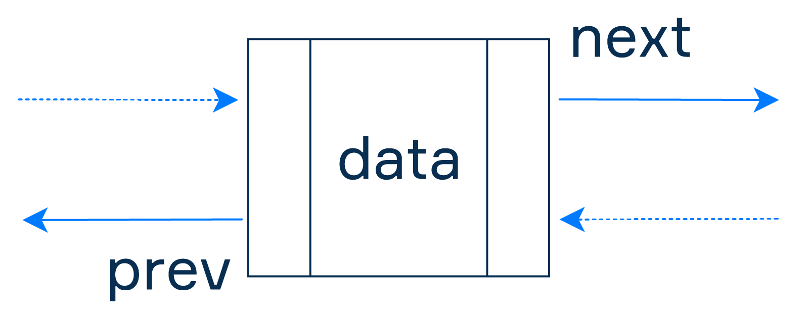
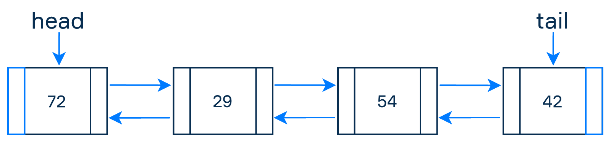
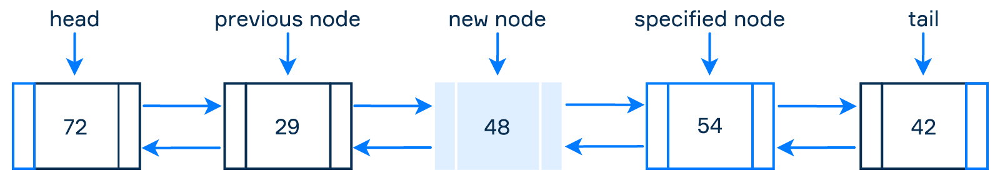
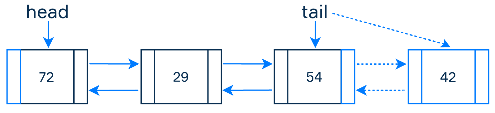

= Collections - workshop

Collections are more sophisticated and flexible than arrays. First of all, they are resizable: you can add any number of elements to a collection. A collection will automatically handle the deletion of an element from any position. The second point is collections provide a rich set of methods that are already implemented for you.

There are several types of collections with different internal storage structure. You can choose a collection type best matching your problem so that your most frequent operations will be convenient and efficient.

We will focus on List, specifically on DoublyLinkedList.

Important thing to notice is how the node in DoublyLinkedList is defined.

=== Basic operations
* Adding new node into the list

* Removing node from the list

A doubly linked list is an unbound linear data structure like a singly linked list, but it provides more flexibility and optimizes some basic operations because it uses an additional reference between the nodes. This is the main reason why this kind of lists is common in standard libraries of many programming languages. But there is one drawback: storing additional references requires more space.

== Task 1. Basic operations
Using provided code, implement following methods:

* addFirst(){}
* addLast(){}
* add(elem){}
* removeFirst(){}
* removeLast(){}
* remove(elem){}

DoublyLinkedList - code:
[source,java]
----
static class Node<E> {

    private E value;
    private Node<E> next;
    private Node<E> prev;

    Node(E element, Node<E> next, Node<E> prev) {
        this.value = element;
        this.next = next;
        this.prev = prev;
    }

    Node<E> getNext() {
        return next;
    }

    Node<E> getPrev() {
        return prev;
    }
}
----

[source, java]
----
class DoublyLinkedList<E>{

    private Node<E> head;
    private Node<E> tail;
    private int size;

    public DoublyLinkedList() {
        size = 0;
    }

    public Node<E> getHead() {
        return head;
    }

    public Node<E> getTail() {
        return tail;
    }

    public int size() {
        return size;
    }

    public boolean isEmpty() {
        return size == 0;
    }

    public String toString() {

        Node<E> tmp = head;
        StringBuilder result = new StringBuilder();

        while (tmp != null) {
            result.append(tmp.value).append(" ");
            tmp = tmp.next;
        }

        return result.toString();
    }
}
----

== Task 2. Even or Odd
Using DoublyLinkedList class you created, write a program, that reads input from the console and inserts even numbers at the beginning, and odd numbers at the back if command is +, and removes first node from the front (rl) or from the tail (rr).

Sample input:
----
+ 1
+ 2
+ 3
+ 4
+ 5
+ 6
+ 7
rr
rl
rl
----

Sample output:
`(6) (4) 2 1 3 5 (7)`

== Task 3. Circular list
You are given a circular list. Initially, the pointer is on the first element. You receive commands for removing elements at different distances to the left or the right from the current one. After an element is removed, the pointer is set right after this element in the traversal direction.

Input: the first line contains two numbers N<1000N<1000 and K<1000K<1000 – the number of elements in the list and the number of commands. The second line contains the elements of the list. The following KK lines represent one of the two commands:

* «r value» removes the element on the right by ‘value’ elements;
* «l value» removes the element on the left by ‘value’ elements.

Output: In the first line, print the resulting list after all removals. The first element of the initial list must be to the left of all other elements of the resulting list.

Sample Input 1:

5 2
1 2 3 4 5
r 1
r 1
Sample Output 1:

1 3 5
Sample Input 2:

5 2
5 9 4 8 11
l 1
r 1
Sample Output 2:

9 4 8
Sample Input 3:

4 2
23 22 21 20
r 1
l 2
Sample Output 3:

23 21